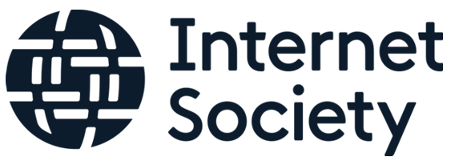
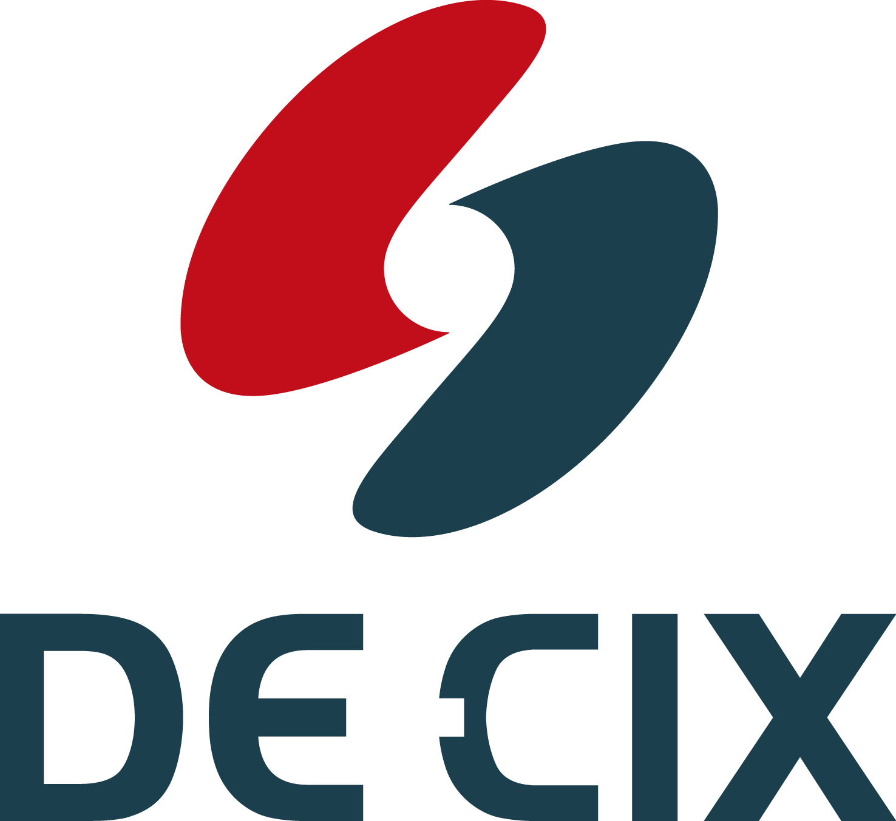

 

    <code></code>

    <code><a href="https://www.internetsociety.org"> ISOC</a> Beyond the Net 2016 </code>

<code></code>

    <code><a href="https://de-cix.net">DE-CIX</a> Premium network interconnection services </code>

    <code></code>

<code><a href="https://www.packet.com">Packet Host Inc.</a> Cloud delivered on bare metal </code>

<code></code>

<code><a href="https://www.webair.com">Webair</a> Managed Hosting solutions </code>

 

---
Individual Donors
---
Oliver Baer 
Anonymous 
 

---
NYC Mesh is in need of the following:
---

Money 
Decent hardware that we can use such as switches, servers, routers, Antennas. 
If you can help us out in any way, please email us at: [contact@nycmesh.net](mailto:contact@nycmesh.net)
